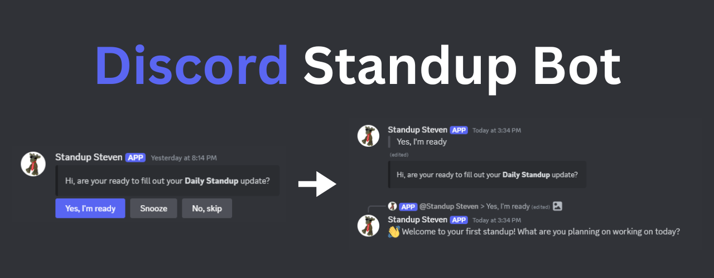

<p align="center">
   
</p>

# Discord Standup Bot
A simple way to conduct daily standups for team members in an agile software development project!

## How it works
- Messages all team members at a certain time of day to fill out their standup
- Includes options to snooze, skip, or continue standup
- The standup will prompt the user to fill out what they worked on the previous day, what their plan is for today, and if they have any blockers
- Standup responses are posted in the server to keep other team members updated
- User responses are stored to the database for future reference
- Users can also force a standup for themselves by using the `/checkin` command

## Tech Stack
- Node.js 
- JavaScript
- Discord.js (to interact w/ Discord API)
- SQLite
- Docker
- AWS (deployed to EC2 instance)

## Prerequisites
- **Node.js**
- **Environment Variables**: set up in a .env file
  - `DISCORD_TOKEN`: Your Discord bot token
  - `GUILD_ID`: The Discord server ID where the bot will operate
  - `CHANNEL_ID`: The Discord channel ID for standup notifications
  - `BOT_ID`: The ID of the Discord bot
  - `HOUR`: The hour of the notification (24-hour format)
  - `MINUTE`: The minute of the notification
- **Docker**: Only required to run in a Docker container

## Running Locally
```bash
node src/index.js
```

## Running Docker Container
Build the image
```bash
docker build -t standup-bot .
```

Run the container (UNIX)
```bash
docker run -d \
  --name standup-bot-container \
  -e DISCORD_TOKEN="token" \
  -e GUILD_ID="discord_server_id" \
  -e CHANNEL_ID="discord_server_channel_id" \
  -e BOT_ID = "discord_bot_id" \
  -e HOUR="hour_of_notification" \
  -e MINUTE="minute_of_notification" \
  standup-bot
```

Run the container (Windows)
```bash
docker run -d `
  --name standup-bot-container `
  -e DISCORD_TOKEN="token" `
  -e GUILD_ID="discord_server_id" `
  -e CHANNEL_ID="discord_server_channel_id" `
  -e BOT_ID = "discord_bot_id" `
  -e HOUR="hour_of_notification" `
  -e MINUTE="minute_of_notification" `
  standup-bot
```